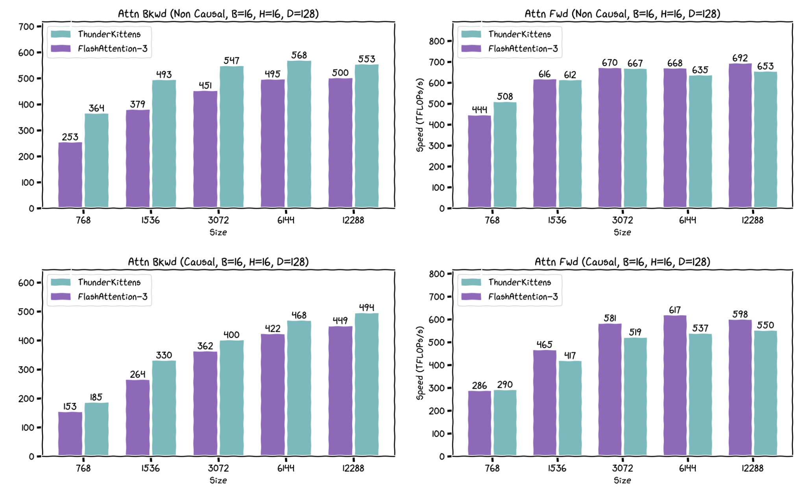

# ThunderKittens

<div align="center" >
    <br/>
    <em>ThunderKittens: Tile primitives for speedy kernels</em><br/><br/>
</div>

**ThunderKittens** is a framework to make it easy to write fast deep learning kernels in CUDA. It is built around three key principles:

1. **Simplicity**. ThunderKittens is stupidly simple to write.
2. **Extensibility**. ThunderKittens is natively embedded into CUDA, so that if you need more than ThunderKittens can offer, it won’t get in your way of building it yourself.
3. **Speed**. Kernels written in ThunderKittens should be at least as fast as those written from scratch -- especially because ThunderKittens can do things the “right” way under the hood. We think our FlashAttention-3 implementation speaks for this point.

<div align="center">
     
</div>

ThunderKittens began as an internal art project and is maintained by graduate students at the [Hazy Research Lab](https://hazyresearch.stanford.edu/). Nonetheless, many AI companies use it for production-scale training and inference (e.g., [Together AI](https://www.together.ai/blog/thunderkittens), Jump Trading, and [Cursor](https://cursor.com/en-US/blog/kernels)).

ThunderKittens is built for NVIDIA GPUs. For AMD GPUs, check out [HipKittens](https://github.com/HazyResearch/HipKittens). 

## Recent Updates

**Nov 17, 2025:** **ThunderKittens 2.0** is out!

* This release brings full support for Blackwell GPUs and NVFP4 precision, and merges major contributions from across the industry.
* We've fixed numerous bugs, improved overall performance, and finally added proper docstrings for most functions.
* The repository structure has changed. We no longer support the repo as a Python package (i.e., a top-level `setup.py`), since ThunderKittens is fundamentally a CUDA framework. Kernels built with ThunderKittens are still located under the `/kernels` directory, and we still welcome new kernel contributions, but they must now be compiled individually. Tests and benchmarks reside alongside their corresponding kernel files. Some kernel examples may break due to this update; please let us know if you find any! 
* Removed all unused files and directories.
* We no longer test on Ampere GPUs (because we don't have any). ThunderKittens should still work on Ampere, but active development and testing are focused on Hopper and Blackwell.

## Overview

ThunderKittens is built from the hardware up; we do what the silicon tells us. And modern GPUs tell us that they want to work with fairly small tiles of data. A GPU is not really a 1000x1000 matrix multiply machine (even if it is often used as such); it’s a manycore processor where each core can efficiently run ~16x16 matrix multiplies. Consequently, ThunderKittens is built around manipulating tiles of data no smaller than 16x16 values.

ThunderKittens makes a few tricky things easy that enable high utilization on modern hardware.

1. Tensor cores. ThunderKittens can call fast tensor core functions, including asynchronous WGMMA calls on H100 GPUs and TCGEN05 calls on B200 GPUs.
2. Shared Memory. I got ninety-nine problems but a bank conflict ain’t one.
3. Loads and stores. Hide latencies with asynchronous copies and address generation with TMA.
4. Distributed Shared Memory. L2 is _so_ last year.
5. Worker overlapping. Use our Load-Store-Compute-Finish template to overlap work and I/O.
6. GPU networking. ThunderKittens lets you transfer data over NVLink and utilize NVSwitch acceleration for fast multi-GPU operations.

#### Example: A Simple Matrix Multiplication Kernel

For example, here’s an example of what a simple matrix multiplication kernel for an H100 looks like written in ThunderKittens.

```Cuda
#include "kittens.cuh"
#include "prototype.cuh"

using namespace kittens;
using namespace kittens::prototype;
using namespace kittens::prototype::lcf;

template<int M_BLOCK, int N_BLOCK>
struct matmul_layout {
    using  base_tile      = st_bf<64, 64>;
    using  global_layout  = gl<bf16, 1, 1, -1, -1, base_tile>;
    struct globals        { global_layout A, B, C; };
    struct input_block    { base_tile a[M_BLOCK], b[N_BLOCK]; };
    struct finish_block   { base_tile c[M_BLOCK][N_BLOCK]; };
    struct common_state   { int2 coord; };
    struct consumer_state { rt_fl<16, N_BLOCK*base_tile::cols> accum; };
};
template<int _M_BLOCK=2, int _N_BLOCK=4, int _SUPER_M=12>
struct matmul_template {
    static constexpr int M_BLOCK = _M_BLOCK, N_BLOCK = _N_BLOCK, SUPER_M = _SUPER_M;
    using layout    = matmul_layout<M_BLOCK, N_BLOCK>;
    using wide_tile = st_bf<64, 64*N_BLOCK>;
    static constexpr int NUM_CONSUMER_WARPS=M_BLOCK*4, INPUT_PIPE_STAGES=4, PRODUCER_BARRIER_ARRIVALS=1;
    // Helper functions
    template<bool PERISISTENT_GRID=true> __host__ static inline dim3 grid(int M, int N, int K) {
        return dim3(PERISISTENT_GRID ? 132 : M*N/(M_BLOCK*N_BLOCK*layout::base_tile::num_elements));
    }
    // ThunderKittens template functions
    __device__ static inline void common_setup(common_setup_args<layout> args) {
        int Rblocks = args.globals.C.rows() / (M_BLOCK*64), Cblocks = args.globals.C.cols() / (N_BLOCK*64);
        int super_rows = (Rblocks/SUPER_M)*SUPER_M,
            final_rows = Rblocks - super_rows,
            super_repeat = SUPER_M*Cblocks;
        int task_id = args.task_iter*gridDim.x + blockIdx.x;
        if (task_id < super_rows * Cblocks)
            args.common.coord = { SUPER_M*(task_id/super_repeat) + task_id%SUPER_M,
                           (task_id%super_repeat)/SUPER_M };
        else if (task_id < Rblocks*Cblocks) {
            int remainder_id = task_id - super_rows*Cblocks;
            args.common.coord = { super_rows + (remainder_id%final_rows), remainder_id/final_rows };
        }
        else { // Id is too high, no more work to do
            args.num_iters = -1;
            return;
        }
        args.num_iters = args.globals.A.cols()/64;
        int id = warpgroup::groupid() == NUM_CONSUMER_WARPS/4 ? 0 : warpgroup::groupid(); // producer sets as 0
        args.common.coord = { args.common.coord.x*M_BLOCK + id, args.common.coord.y*N_BLOCK };
    }
    struct producer {
        __device__ static void setup(producer_setup_args<layout> args) {
            warpgroup::decrease_registers<40>(); // decrease registers for producers
        }
        __device__ static void load(producer_load_args<layout> args) {
            if (warpgroup::laneid() == 0) {
                tma::expect(args.inputs_arrived, args.input);
                for(int i = 0; i < M_BLOCK; i++)
                    tma::load_async(args.input.a[i], args.globals.A,
                                    {args.common.coord.x+i, args.iter}, args.inputs_arrived);
                for(int i = 0; i < N_BLOCK; i++)
                    tma::load_async(args.input.b[i], args.globals.B,
                                    {args.iter, args.common.coord.y+i}, args.inputs_arrived);
            }
        }
    };
    struct consumer {
        __device__ static void setup(consumer_setup_args<layout> args) {
            warpgroup::increase_registers<232>(); // increase registers for consumers
            kittens::warp::zero(args.state.accum);
        }
        __device__ static void compute(consumer_compute_args<layout> args) {
            warpgroup::mma_AB(
                args.state.accum, // dest registers
                args.input.a[warpgroup::groupid()], // A matrix
                reinterpret_cast<wide_tile&>(args.input.b) // B matrix
            );
            warpgroup::mma_async_wait();
            if (warp::laneid() == 0) arrive(args.inputs_finished);
        }
        __device__ static void finish(consumer_finish_args<layout> args) {
            warpgroup::store(reinterpret_cast<wide_tile&>(args.finish.c[warpgroup::groupid()]), args.state.accum);
            warpgroup::sync(warpgroup::groupid()+4);
            if (warpgroup::laneid() == 0) for(int i = 0; i < N_BLOCK; i++) {
                tma::store_async(args.globals.C, args.finish.c[warpgroup::groupid()][i],
                                             {args.common.coord.x, args.common.coord.y+i});
                tma::store_async_read_wait(); // wait that store is finished before reusing finish memory
            }
            kittens::warp::zero(args.state.accum);
            if (warp::laneid() == 0) arrive(args.finish_finished);
        }
    };
};
```

Altogether, this is less than 100 lines of code, and achieves about 855 TFLOPs on an H100 (86% of theoretical max). We’ll go through some of these primitives more carefully later, in the ThunderKittens Manual section.

## Installation

**ThunderKittens is a header-only library**. The library itself does not require any installation; just clone the repo, and include `kittens.cuh`. Easy money.

#### Hardware requirements

* ThunderKittens is mainly built and tested for Hopper and Blackwell GPUs.
* We make our best effort to support Ampere GPUs too, but some features may not work correctly. Contributions are welcome!

#### Build requirements

But ThunderKittens does use a bunch of modern stuff, so it has fairly aggressive requirements.

* **CUDA 12.6+**. Anything after CUDA 12.1 will _probably_ work, but you'll likely end up with serialized wgmma pipelines on H100s due to a bug in those earlier versions of CUDA. We do our dev work on CUDA 12.6-12.9, because we want our kittens to play in the nicest, most modern environment possible. Make sure you run the following to set up your CUDA environment properly:

    ```bash
    export CUDA_HOME=/usr/local/cuda-<YOUR-CUDA-VERSION> # ex. cuda-12.6
    export PATH=${CUDA_HOME}/bin:${PATH} 
    export LD_LIBRARY_PATH=${CUDA_HOME}/lib64:$LD_LIBRARY_PATH
    ```

* **C++20**. TK runs on `concepts`. If you get weird compilation errors, chances are your `gcc` is out of date. Update your compiler with:

    ```bash
    sudo apt update
    sudo apt install gcc-11 g++-11

    sudo update-alternatives --install /usr/bin/gcc gcc /usr/bin/gcc-11 100 --slave /usr/bin/g++ g++ /usr/bin/g++-11

    sudo apt update
    sudo apt install clang-11
    ```

Sometimes, there's a libc10.so error, which you can fix with:

```bash
# Take the <PRINTED_PATH> from below
python -c "import torch; print(torch.file)"

# And run the command below
export LD_LIBRARY_PATH=<PRINTED_PATH>/lib:$LD_LIBRARY_PATH
```

#### Using pre-implemented kernels

We've provided a number of ThunderKittens kernels in the `kernels/` folder, which can be easily called from your PyTorch code. To use these kernels:

1. Make sure the currently activated Python environment has PyTorch 2.8+ and PyBind11 installed. Ensure your PyTorch version meets the CUDA version (follow the [official instructions](https://pytorch.org/get-started/locally/)).
2. (Optional) Set environment variables. Our build system sets this for you, but it's quite slow to set it every time. So it is recommended to set them first.

    ```bash
    # Make sure the Python environment you want to use is active and called by python3.
    export PYTHON_VERSION=$(python3 -c "import sysconfig; print(sysconfig.get_config_var('LDVERSION'))")
    export PYTHON_INCLUDES=$(python3 -c "import sysconfig; print('-I', sysconfig.get_path('include'), sep='')")
    export PYBIND_INCLUDES=$(python3 -m pybind11 --includes)
    export PYTORCH_INCLUDES=$(python3 -c "from torch.utils.cpp_extension import include_paths; print(' '.join(['-I' + p for p in include_paths()]))")
    export PYTHON_LIBDIR=$(python3 -c "import sysconfig; print('-L', sysconfig.get_config_var('LIBDIR'), sep='')")
    export PYTORCH_LIBDIR=$(python3 -c "from torch.utils.cpp_extension import library_paths; print(' '.join(['-L' + p for p in library_paths()]))")
    ```

3. `cd` into the kernel directory you want to build (e.g., `kernels/gemm/B200`).
4. Build:

    ```bash
    make
    ```

5. Import the resulting shared library file in your Python code and call the kernel!

The tests and benchmarks for these kernels are located alongside their source files. Note that the top-level `tests/` directory contains tests for the ThunderKittens primitives, not for the kernels built using ThunderKittens!

## ThunderKittens Manual

ThunderKittens is actually a pretty small library, in terms of what it gives you.

* Data types: (Register + shared) * (tiles + vectors), all parameterized by layout, type, and size.
* Operations for manipulating these objects.

Therefore, the best way to learn ThunderKittens is to start looking into kernels and run the them yourself! We have a step-by-step, educational kernel series on matrix multiplication under [kernels/gemm/educational](kernels/gemm/educational).

Once you get used to its APIs, there are still a few sharp edges that you might encounter if you don’t know what’s going on under the hood. So, we do recommend giving this manual a good read before sitting down to write a serious kernel -- it’s not too long, we promise!

#### NVIDIA’s Programming Model

To understand ThunderKittens, it will help to begin by reviewing a bit of how NVIDIA’s programming model works, as NVIDIA provides a few different “scopes” to think about when writing parallel code.

1. **Thread**: this is the level of doing work on an individual bit of data, like a floating point multiplication. A thread has up to 256 32-bit registers it can access every cycle.
2. **Warp**: 32 threads make a warp. This is the level at which instructions are issued by the hardware. It’s also the base (and default) scope from which ThunderKittens operates; most ThunderKittens programming happens here.
3. **Warpgroup**: 4 warps make a warpgroup. This is the level from which asynchronous warpgroup matrix multiply-accumulate instructions are issued. (We really wish we could ignore this level, but you unfortunately need it for the H100.) Correspondingly, many matrix multiply and memory operations are supported at the warpgroup level.
4. **Block**: N warps make a block, which is the level that shares “shared memory” in the CUDA programming model. In ThunderKittens, N is often 8.
5. **Grid**: M blocks make a grid, where M should be equal to (or slightly less) than a multiple of the number of SMs on the GPU to avoid tail effects. ThunderKittens does not touch the grid scope except through helping initialize TMA descriptors.

“Register” objects exist at the level of warps; their contents are split amongst the threads of the warp. Register objects include:

* Register tiles, declared as the `kittens::rt` struct in `src/register_tile/rt.cuh`. Kittens provides a few useful wrappers -- for example, a 32 row, 16 column, row-layout bfloat16 register tile can be declared as `kittens::rt_bf<32,16>;` -- row-layout is implicit by default.
* Register vectors, which are associated with register tiles. They come in three flavors: naive, aligned, and orthogonal. What's going on under the hood is a bit too complicated for a readme, but what you need to know is that the naive layout is used for when you expect to do lots of compute on vectors (like a layernorm), and otherwise you should just instantiate column or row vectors depending on how you want to interact with a tile, and let TK take care of the layout for you. Column vectors are used to reduce or map across tile rows (it's a single column of the tile), and row vectors reduce and map across tile columns (a single row of the tile). For example, to hold the sum of the rows of the tile declared above, we would create a `kittens::rt_bf<32,16>::col_vec;`

In contrast, “Shared” objects exist at the level of the block, and sit only in shared memory.

All ThunderKittens functions follow a common signature. Much like an assembly language (ThunderKittens' origin comes from thinking about an idealized tile-oriented RISC instruction set), the destination of every function is the first operand, and the source operands are passed sequentially afterwards.

For example, if we have three 32 row, 64 col floating point register tiles: `kittens::rt_fl<32,64> a, b, c;`, we can element-wise multiply `a` and `b` and store the result in `c` with the following call: `kittens::mul(c, a, b);`.

Similarly, if we want to then store the result into a half-precision shared tile `__shared__ kittens:st_hf<32, 64> s;`, we write the function analogously: `kittens::store(s, c);`.

#### Typing

ThunderKittens tries hard to protect you from yourself. In particular, ThunderKittens wants to know layouts of objects at compile-time and will make sure they’re compatible before letting you do operations. This is important because there are subtleties to the allowable layouts for certain operations, and without static checks it is very easy to get painful silent failures. For example, a normal matrix multiply requires the B operand to be in a column layout, whereas an outer dot product requires the B operand to be in a row layout.

If you are being told an operation that you think exists doesn't exist, double-check your layouts -- this is the most common error. Only then report a bug :)

#### Scopes

By default, ThunderKittens operations exist at the warp-level. In other words, each function expects to be called by only a single warp, and that single warp will do all of the work of the function. If multiple warps are assigned to the same work, undefined behavior will result. (And if the operation involves memory movement, it is likely to be completely catastrophic.) In general, you should expect your programming pattern to involve instantiating a `warpid` at the beginning of the kernel with `kittens::warpid()`, and assigning tasks to data based on that id.

However, not all ThunderKittens functions operate at the warp level. Many important operations, particularly WGMMA instructions, require collaborative groups of warps. These operations exist in the templated `kittens::group<collaborative size>`. For example, wgmma instructions are available through `kittens::group<4>::mma_AB` (or `kittens::warpgroup::mma_AB`, which is an alias.) Groups of warps can also collaboratively load shared memory or do reductions in shared memory

#### Other Restrictions

Most operations in ThunderKittens are pure functional. However, some operations _do_ have special restrictions; ThunderKittens tries to warn you by giving them names that stand out. For example, a register tile transpose needs separable arguments: if it is given the same underlying registers as both source and destination, it will silently fail. Consequently, it is named `transpose_sep`.

#### Onboarding document

We have a slightly outdated and incomplete [onboarding document](https://docs.google.com/document/d/15-Zvf6e0NLX1si4ml4sUOWCDlXNMtOWKiuo6CKZMEYA/edit?usp=sharing). Please contribute to this if you've run into issues and feel the broader community can benefit from explanations. Please leave comments if any aspect of this is unclear. 

## Demos

<div align="center" >
     
</div><br/>

We've included a set of starter demos in the [demos/](https://github.com/HazyResearch/ThunderKittens/tree/main/demos) folder, showing how to use TK kernels for training and LLM inference (Qwens, Llamas, LoLCATS LLMs, etc.)! 

We're also excited to feature any demos you build, please link PRs!

#### General setup 

Several of these demos are set up to use large 8B models from Hugging Face. To setup, run `login`:

```bash 
huggingface-cli login
```
Set the directory at which you want the models to download in the `_model_config.yaml` file in the `demos/configs/` directory.

Next, install the TK kernels: 

1. From the `ThunderKittens/` directory, run `source env.src` to set the environment variables.
2. In `ThunderKittens/config.py` select `hedgehog` and `attn` and run `python setup.py install` to install the TK kernels.

#### Attention 

Attention powers a large number of current LLMs. TK includes forwards / prefill and backwards kernels. We include causal, non-causal, and GQA variants.

We include LLM inference integrations:

* [Llama 3 8B](https://huggingface.co/meta-llama/Meta-Llama-3-8B) with TK GQA attention
* [Qwen 2.5 7B](https://huggingface.co/Qwen/Qwen2.5-7B-Instruct) with TK attention

```bash
cd llama_demo/
bash demo_8b.sh
```

And enter your prompt, e.g., "The capital of America is"

#### LoLCATS

[LoLCATS](https://github.com/HazyResearch/lolcats) is a recent state-of-the-art method for converting quadratic attention Transformer LLMs to linear attention LLMs. TK includes a forwards / prefill kernel. 

We include:

* [LoLCATS-Llama 3.1 8B](https://huggingface.co/collections/hazyresearch/lolcats-670ca4341699355b61238c37) with TK .

```bash
cd lolcats_demo/
bash demo_8b.sh
```
And enter your prompt, e.g., "The capital of America is"

#### Based

[Based](https://github.com/HazyResearch/based/tree/main) is a linear attention architecture that combines short sliding window attentions with large-state-size linear attentions. TK includes a forwards / prefill kernel.

Added installs:

```bash
pip install -U git+https://github.com/sustcsonglin/flash-linear-attention
```

We include:

* [Based 1.3B](https://huggingface.co/hazyresearch/my-awesome-model) with TK on a series of recall-intensive in-context learning tasks.

#### Your Demos!

If you use TK to build any demos, please reach out / make a PR! We'd love to feature it here!!

* DeltaNet: https://github.com/proger/accelerated-scan/tree/delta

## Tests

ThunderKittens has fairly comprehensive unit testing suite. Simply run `make -j` in the `tests/` folder. Be warned: this may nuke your computer for a minute or two while it compiles thousands of kernels.

#### Compilation Options

The `tests/Makefile` provides several options to customize the test:

* `GPU_TARGET`: Set to either `H100` or `B200` to specify the target GPU architecture (default: H100).
* `COMP_LEVEL`: Set the compiler optimization level. Available options are `fast`, `debug`, and `profile` (default: fast).
* `TEST_INTENSITY`: Set the level of test intensity. Higher levels compile more tests but take longer. Available options are 1, 2, 3, and 4 (default: 2).
* `TEST_ALL`: Compile and run all available tests. You can also specify individual test sections or tests using flags like -DTEST_WARP_MEMORY or -DTEST_WARP_MEMORY_VEC_DSMEM.

#### Running the Tests

After successful compilation, run the tests using:

```bash
mkdir outputs
./unit_tests printout
```

This will execute the compiled unit tests and dump results of any failed tests to the `outputs/` folder. As a quick note, it is expected for mma tests to occasionally fail. Careful inspection of the output will usually show just a single element differing by a small amount, which we think is due to how floating-point arithmetic is implemented within the tensor cores.

#### Cleaning the Build

To clean the build directory and remove the compiled binary, run:

```bash
make clean
```

## Learn more and get involved!

Learn more about ThunderKittens and how GPUs work by checking out our blogs:

* [GPUs Go Brrr, May 2024](https://hazyresearch.stanford.edu/blog/2024-05-12-tk)
* [Easier, Better, Faster, Cuter, Oct. 2024](https://hazyresearch.stanford.edu/blog/2024-10-29-tk2)
* [ThunderKittens: Bringing fp8 to theaters near you, Nov 2024](https://hazyresearch.stanford.edu/blog/2024-11-27-tk-fp8)
* [ThunderMLA: FlashMLA, Faster and Fused-er! Mar 2025](https://hazyresearch.stanford.edu/blog/2025-03-04-thundermla)
* [ThunderKittens Now on Blackwells! Mar 2025](https://hazyresearch.stanford.edu/blog/2025-03-15-tk-blackwell)
* [Look Ma, No Bubbles! Designing a Low-Latency Megakernel for Llama-1B, May 2025](https://hazyresearch.stanford.edu/blog/2025-05-27-no-bubbles)
* [One Kernel for All Your GPUs, Sep 2025](https://hazyresearch.stanford.edu/blog/2025-09-22-pgl)
* [We Bought the Whole GPU, So We're Damn Well Going to Use the Whole GPU, Sep 2025](https://hazyresearch.stanford.edu/blog/2025-09-28-tp-llama-main)
* [Loads and Loads of Fluffy Kittens, Nov 2025](https://hazyresearch.stanford.edu/blog/2025-11-17-fluffy-kittens)

Explore the Kittens Cinematic Universe:

* [ThunderKittens](https://github.com/HazyResearch/ThunderKittens) for NVIDIA
* [HipKittens](https://github.com/HazyResearch/HipKittens) for AMD
* [ThunderMittens](https://github.com/HazyResearch/ThunderMittens) for Apple Silicon

Please check out our papers for even more details!

* [Single GPU](https://arxiv.org/abs/2410.20399)
* [Multiple GPUs](TODO)

Finally, join us on Discord to get involved: [ThunderKittens channel @ GPU Mode Discord](https://discord.com/channels/1189498204333543425/1300872762163728550)!!!! Here is the invite link to GPU mode: https://discord.gg/gpumode

## License

This project is licensed under the terms of the MIT license.
