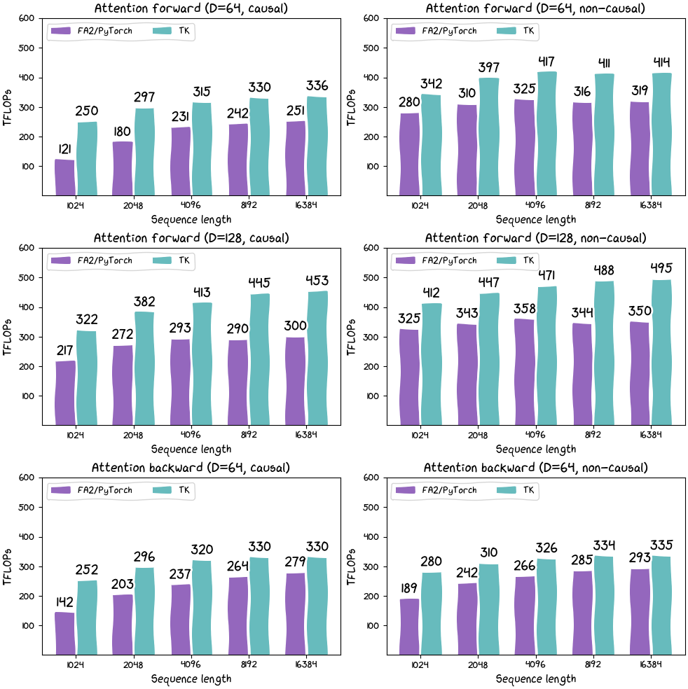

# ThunderKittens
### Tile primitives for speedy kernels

<div align="center" >
     
</div>

<br>
<br>

ThunderKittens is a framework to make it easy to write fast deep learning kernels in CUDA (and, soon, ROCm and others, too!)

ThunderKittens is built around three key principles:
1. Simplicity. ThunderKittens is stupidly simple to write.
2. Extensibility. ThunderKittens embeds itself natively, so that if you need more than ThunderKittens can offer, it won’t get in your way of building it yourself.
3. Speed. Kernels written in ThunderKittens should be at least as fast as those written from scratch -- especially because ThunderKittens can do things the “right” way under the hood. We think our Flash Attention 2 implementation speaks for this point.

<div align="center" >
     
</div>

ThunderKittens is built from the hardware up -- we do what the silicon tells us. And modern GPUs tell us that they want to work with fairly small tiles of data. A GPU is not really a 1000x1000 matrix multiply machine (even if it is often used as such); it’s a manycore processor where each core can efficiently run ~16x16 matrix multiplies. Consequently, ThunderKittens is built around manipulating tiles of data no smaller than 16x16 values.

ThunderKittens makes a few tricky things easy that enable high utilization on modern hardware.
1. Tensor cores. ThunderKittens can call fast tensor core functions, including asynchronous WGMMA calls on H100 GPUs.
2. Shared Memory. I got ninety-nine problems but a bank conflict ain’t one.
3. Loads and stores. Hide latencies with asynchronous copies and address generation with TMA.
4. Distributed Shared Memory. L2 is _so_ last year.

*Example: A Simple Atention Kernel*

Here’s an example of what a simple FlashAttention-2 kernel for an RTX 4090 looks like written in ThunderKittens.

```Cuda
#define NUM_WORKERS 16 // This kernel uses 16 workers in parallel per block, to help issue instructions more quickly.

using namespace kittens; // this kernel only handles headdim=64 for simplicity. Also n should be a multiple of 256 here.
__global__ void attend_ker64(int n, const bf16* __restrict__ __q__, const bf16* __restrict__ __k__, const bf16* __restrict__ __v__, bf16* __o__) {

    auto warpid        = kittens::warpid();
    auto block_start   = blockIdx.x*(n*64);
    const bf16 *_q = __q__ + block_start, *_k = __k__ + block_start, *_v = __v__ + block_start;
          bf16 *_o = __o__ + block_start;

    extern __shared__ alignment_dummy __shm[]; // this is the CUDA shared memory
    shared_allocator al((int*)&__shm[0]);
    
    // K and V live in shared memory -- this is about all that will fit.
    st_bf_1x4<ducks::st_layout::swizzle> (&k_smem)[NUM_WORKERS] = al.allocate<st_bf_1x4<ducks::st_layout::swizzle>, NUM_WORKERS>();
    st_bf_1x4<ducks::st_layout::swizzle> (&v_smem)[NUM_WORKERS] = al.allocate<st_bf_1x4<ducks::st_layout::swizzle>, NUM_WORKERS>();

    // Initialize all of the register tiles.
    rt_bf_1x4<> q_reg, k_reg, v_reg; // v_reg need to be swapped into col_l
    rt_fl_1x1<> att_block;
    rt_bf_1x1<> att_block_mma;
    rt_fl_1x4<> o_reg;
    rt_fl_1x1<>::col_vec max_vec_last, max_vec; // these are column vectors for the attention block
    rt_fl_1x1<>::col_vec norm_vec_last, norm_vec; // these are column vectors for the attention block
    
    int qo_blocks = n / (q_reg.rows*NUM_WORKERS), kv_blocks = n / (q_reg.rows*NUM_WORKERS);

    for(auto q_blk = 0; q_blk < qo_blocks; q_blk++) {

        // each warp loads its own Q tile of 16x64, and then multiplies by 1/sqrt(d)
        load(q_reg, _q + (q_blk*NUM_WORKERS + warpid)*q_reg.num_elements, q_reg.cols);
        mul(q_reg, q_reg, __float2bfloat16(0.125f)); // temperature adjustment

        // zero flash attention L, M, and O registers.
        neg_infty(max_vec); // zero registers for the Q chunk
        zero(norm_vec);
        zero(o_reg);

        // iterate over k, v for these q's that have been loaded
        for(auto kv_idx = 0; kv_idx < kv_blocks; kv_idx++) {

            // each warp loads its own chunk of k, v into shared memory
            load(v_smem[warpid], _v + (kv_idx*NUM_WORKERS + warpid)*q_reg.num_elements, q_reg.cols);
            load(k_smem[warpid], _k + (kv_idx*NUM_WORKERS + warpid)*q_reg.num_elements, q_reg.cols);
            __syncthreads(); // we need to make sure all memory is loaded before we can begin the compute phase

            // now each warp goes through all of the subtiles, loads them, and then does the flash attention internal alg.
            for(int subtile = 0; subtile < NUM_WORKERS; subtile++) {

                load(k_reg, k_smem[subtile]); // load k from shared into registers

                zero(att_block); // zero 16x16 attention tile
                mma_ABt(att_block, q_reg, k_reg, att_block); // Q@K.T

                copy(norm_vec_last, norm_vec);
                copy(max_vec_last,  max_vec);

                row_max(max_vec, att_block, max_vec); // accumulate onto the max_vec
                sub_row(att_block, att_block, max_vec); // subtract max from attention -- now all <=0
                exp(att_block, att_block); // exponentiate the block in-place.

                sub(max_vec_last, max_vec_last, max_vec); // subtract new max from old max to find the new normalization.
                exp(max_vec_last, max_vec_last); // exponentiate this vector -- this is what we need to normalize by.
                mul(norm_vec, norm_vec, max_vec_last); // and the norm vec is now normalized.

                row_sum(norm_vec, att_block, norm_vec); // accumulate the new attention block onto the now-rescaled norm_vec
                div_row(att_block, att_block, norm_vec); // now the attention block is correctly normalized

                mul(norm_vec_last, norm_vec_last, max_vec_last); // normalize the previous norm vec according to the new max
                div(norm_vec_last, norm_vec_last, norm_vec); // normalize the previous norm vec according to the new norm

                copy(att_block_mma, att_block); // convert to bf16 for mma_AB

                load(v_reg, v_smem[subtile]); // load v from shared into registers.
                rt_bf_1x4<ducks::rt_layout::col> &v_reg_col = swap_layout_inplace(v_reg); // this is a reference and the call has invalidated v_reg

                mul_row(o_reg, o_reg, norm_vec_last); // normalize o_reg in advance of mma_AB'ing onto it
                mma_AB(o_reg, att_block_mma, v_reg_col, o_reg); // mfma onto o_reg with the local attention@V matmul.
            }
            __syncthreads(); // we need to make sure all warps are done before we can start loading the next kv chunk
        }

        store(_o + (q_blk*NUM_WORKERS + warpid)*q_reg.num_elements, o_reg, q_reg.cols); // write out o. compiler has an issue with register usage if d is made constexpr q_reg.rows :/
    }
}
```

Altogether, this is 58 lines of code (not counting whitespace), and achieves about 122 TFLOPs on an RTX 4090. (74% of theoretical max.) We’ll go through some of these primitives more carefully in the next section, the ThunderKittens manual.

## Installation

To use Thunderkittens, there's not all that much you need to do with TK itself. It's a header only library, so just clone the repo, and include kittens.cuh. Easy money.

But ThunderKittens does use a bunch of modern stuff, so it has fairly aggressive requirements.
 - CUDA 12.3+. Anything after CUDA 12.1 will _probably_ work, but you'll likely end up with serialized wgmma pipelines due to a bug in those earlier versions of CUDA.
 - (Extensive) C++20 use -- TK runs on concepts.

```
sudo apt update
sudo apt install gcc-10 g++-10

sudo update-alternatives --install /usr/bin/gcc gcc /usr/bin/gcc-10 100 --slave /usr/bin/g++ g++ /usr/bin/g++-10

sudo apt update
sudo apt install clang-10
```

If you can't find nvcc, or you experience issues where your environment is pointing to the wrong CUDA version:
```
export CUDA_HOME=/usr/local/cuda-12/
export PATH=${CUDA_HOME}/bin:${PATH} 
export LD_LIBRARY_PATH=${CUDA_HOME}/lib64:$LD_LIBRARY_PATH
```

Finally, thanks to Jordan Juravskey for putting together a quick doc on setting up a [kittens-compatible conda](https://github.com/HazyResearch/ThunderKittens/blob/main/docs/conda_setup.md).

## Tests

To validate your install, and run TK's fairly comprehensive unit testing suite, simply run `make -j` in the tests folder. Be warned: this may nuke your computer for a minute or two while it compiles thousands of kernels.

## Examples

To compile examples, run `source env.src` from the root directory before going into the examples directory. (Many of the examples use the `$THUNDERKITTENS_ROOT` environment variable to orient themselves and find the src directory.

## ThunderKittens Manual

ThunderKittens is actually a pretty small library, in terms of what it gives you.

 - Data types: (Register + shared) * (tiles + vectors), all parameterized by layout, type, and size.
 - Operations for manipulating these objects.

Despite its simplicity, there are still a few sharp edges that you might encounter if you don’t know what’s going on under the hood. So, we do recommend giving this manual a good read before sitting down to write a kernel -- it’s not too long, we promise!

### NVIDIA’s Programming Model

To understand ThunderKittens, it will help to begin by reviewing a bit of how NVIDIA’s programming model works, as NVIDIA provides a few different “scopes” to think about when writing parallel code.
1. Thread -- this is the level of doing work on an individual bit of data, like a floating point multiplication. A thread has up to 256 32-bit registers it can access every cycle.
2. Warp -- 32 threads make a warp. This is the level at which instructions are issued by the hardware. It’s also the base (and default) scope from which ThunderKittens operates; most ThunderKittens programming happens here.
3. Warpgroup -- 4 warps make a warpgroup. This is the level from which asynchronous warpgroup matrix multiply-accumulate instructions are issued. (We really wish we could ignore this level, but you unfortunately need it for the H100.) Correspondingly, many matrix multiply and memory operations are supported at the warpgroup level.
4. Block -- N warps make a block, which is the level that shares “shared memory” in the CUDA programming model. In ThunderKittens, N is often 8.
5. Grid -- M blocks make a grid, where M should be equal to (or slightly less) than a multiple of the number of SMs on the GPU to avoid tail effects. ThunderKittens does not touch the grid scope except through helping initialize TMA descriptors.

“Register” objects exist at the level of warps -- their contents is split amongst the threads of the warp. Register objects include:
- Register tiles, declared as the `kittens::rt` struct in `src/register_tile/rt.cuh`. Kittens provides a few useful wrappers -- for example, a 32x16 row-layout bfloat16 register tile can be declared as `kittens::rt_bf_2x1;` -- row-layout is implicit by default.
- Register vectors, which are associated with register tiles. They come in two flavors: column vectors and row vectors. Column vectors are used to reduce or map across tile rows, and row vectors reduce and map across tile columns. For example, to hold the sum of the rows of the tile declared above, we would create a `kittens::rt_bf_2x1<>::col_vec;`
In contrast, “Shared” objects exist at the level of the block, and sit only in shared memory.

All ThunderKittens functions follow a common signature. Much like an assembly language (ThunderKittens is in essence an abstract tile-oriented RISC instruction set), the destination of every function is the first operand, and the source operands are passed sequentially afterwards.

For example, if we have three 32x64 floating point register tiles: `kittens::rt_fl_2x4 a, b, c;`, we can element-wise multiply `a` and `b` and store the result in `c` with the following call: `kittens::mul(c, a, b);`.

Similarly, if we want to then store the result into a shared tile `__shared__ kittens:st_bf_2x4 s;`,we write the function analogously: `kittens::store(s, c);`.

### Typing

ThunderKittens tries hard to protect you from yourself. In particular, ThunderKittens wants to know layouts of objects at compile-time and will make sure they’re compatible before letting you do operations. This is important because there are subtleties to the allowable layouts for certain operations, and without static checks it is very easy to get painful silent failures. For example, a normal matrix multiply requires the B operand to be in a column layout, whereas an outer dot product requires the B operand to be in a row layout.

If you are being told an operation that you think exists doesn't exist, double-check your layouts -- this is the most common error. Only then report a bug :)

### Scopes

By default, ThunderKittens operations exist at the warp-level. In other words, each function expects to be called by only a single warp, and that single warp will do all of the work of the function. If multiple warps are assigned to the same work, undefined behavior will result. (And if the operation involves memory movement, it is likely to be completely catastrophic.) In general, you should expect your programming pattern to involve instantiating a `warpid` at the beginning of the kernel with `kittens::warpid()`, and assigning tasks to data based on that id.

However, not all ThunderKittens functions operate at the warp level. Many important operations, particularly WGMMA instructions, require collaborative groups of warps. These operations exist in the templated `kittens::group<collaborative size>`. For example, wgmma instructions are available through `kittens::group<4>::mma_AB` (or `kittens::warpgroup::mma_AB`, which is an alias.) Groups of warps can also collaboratively load shared memory or do reductions in shared memory

### Other Restrictions

Most operations in ThunderKittens are pure functional. However, some operations _do_ have special restrictions; ThunderKittens tries to warn you by giving them names that stand out. For example, a register tile transpose needs separable arguments: if it is given the same underlying registers as both source and destination, it will silently fail. Consequently, it is named `transpose_sep`.
