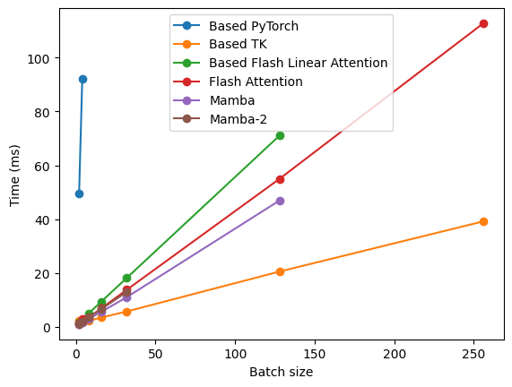

# Based Architecture with ThunderKittens 

Here we provide a demo for running inference for pretrained [Based architecture language models](https://arxiv.org/abs/2402.18668) using TK kernels on an NVidia H100 GPU! 

The Based architecture is notable for (1) showing the value of **hybridizing local attention (window sizes $\leq 128$)** with linear attention and (2) building a method to **increase the linear attention state size in hardware efficient ways**. 

Due to these properties, Based expands the Pareto frontier of the quality-efficiency tradeoff space beyond other sub-quadratic architectures! 
- Based-TK prefill is **faster than the Mamba kernel**, even though Mamba uses $8\times$ less GPU memory ("recurrent state size") during inference! 
- Based-TK prefill is also **faster than the Mamba-2 kernel and Flash Linear Attention kernels**, especially for large batch and long context settings, controlling for the recurrent state size (GPU memory consumption)! 

Explore our hardware-efficient architecture and algorithm in the demo below! We've provided code to reproduce these results with pretrained models from Hugging Face!

<div align="center" >
     
</div>


Setup python environment:
```bash
conda create -n dev python=3.11
pip3 install torch torchvision torchaudio
pip install transformers
pip install einops
pip install hydra-core
pip install flash-attn
```

Setup ThunderKittens kernels. First, in ``ThunderKittens/config.py`` select "based". Then:
```bash 
python setup.py install 
```

## Run the generation demo with pretrained LMs!

Run the models on document QA and information extraction workloads, which stress test the *in context learning ability* of different architetures! We compute model accuracy and the total time to complete the task. Each of the models below is trained on the exact same data to make it easy to compare.
```bash
cd ThunderKittens/demos/based_demo/
python document_ie_based.py -- model_name based
python document_ie_based.py -- model_name attn
python document_ie_based.py -- model_name mamba
```

Run generation with prompts of your choice:
```bash
python generate_based.py
```

## Benchmarking!

### Grab some benchmarking baselines 
As a baseline for TK, you can optionally install Flash Linear Attention CUDA kernels and Mamba kernels.
```
git clone https://github.com/sustcsonglin/flash-linear-attention.git
pip install -U git+https://github.com/sustcsonglin/flash-linear-attention

pip install mamba_ssm
```

### E2E Pretrained Model Benchmarking
To run the benchmarking script and produce a plot to compare different (linear) attention approaches *on the end-to-end models*, run:
```bash
python benchmark.py
```
You should obtain the following plot for 360M parameter pretrained LMs from Hugging Face.
<div align="center" >
     
</div>

### Standalone kernel benchmarking 

To benchmark the standalone kernel:
```bash
python benchmark_kernel.py
```
You should be able to reproduce the plot shown up top in this README.

*Note* the Mamba kernels create frequent issues (CUDA_DEVICE_SIDE ASSERTS). Please comment out those baselines if you run into difficulty, or use smaller tensor sizes. The kernel uses int32 to compute memory addresses, making it difficult to support large tensors (i.e., for large-batch or long-sequence modeling).


Please cite the following if you use or build off this code or linear attention kernel:
```
@article{arora2024simple,
  title={Simple linear attention language models balance the recall-throughput tradeoff},
  author={Arora, Simran and Eyuboglu, Sabri and Zhang, Michael and Timalsina, Aman and Alberti, Silas and Zinsley, Dylan and Zou, James and Rudra, Atri and Ré, Christopher},
  journal={arXiv:2402.18668},
  year={2024}
}

@software{spector2024thunderkittens,
  title={ThunderKittens: A Simple Embedded DSL for AI Kernels},
  author={Spector, Benjamin and Singhal, Aaryan and Arora, Simran and Ré, Christopher},
  url={https://github.com/HazyResearch/ThunderKittens},
  year={2024}
}
```

